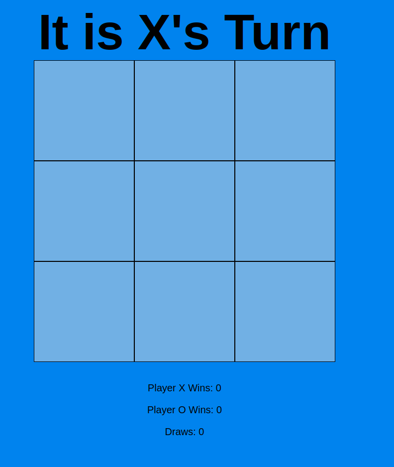

# Tic-Tac-Toe

Names: Muhammad Haris & 
Student #'s: 300157052 &
[GitHub](https://github.com/mharis337/Tic-Tac-Toe) 
[Design System](/docs/design_system.md)

## Description:
We implemented the game Tic-Tac-Toe. The game starts with an empty 3x3 grid and a block of text above indicating the player's turn, beginning with X. Players take turns placing their marks on the board. A player wins by forming a line vertically, horizontally, or diagonally. If all cells are filled without any player forming a line, the game ends in a draw. At the end of the game, a screen appears asking if the players want to play again. If they choose to, the board is reset, and a new game begins.

## UI States

### Empty Board

### First Move

### Winner

### Draw

